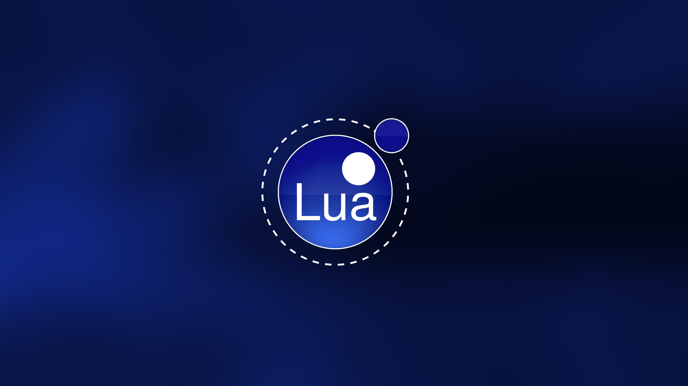

<p align="center">
  
</p>

<p align="center">
  <a href="https://github.com/dunamismax/lua-gaming">
    
  </a>
</p>

<p align="center">
  <a href="https://www.lua.org/"></a>
  <a href="https://love2d.org/"></a>
  <a href="https://www.lexaloffle.com/pico-8.php"></a>
  <a href="https://tic80.com/"></a>
  <a href="https://img.shields.io/github/license/dunamismax/lua-gaming"></a>
  <a href="https://github.com/dunamismax/lua-gaming/pulls"></a>
  <a href="https://github.com/dunamismax/lua-gaming/stargazers"></a>
</p>

---

## About This Project

A comprehensive, production-ready monorepo for game development using the complete Lua gaming ecosystem. This repository demonstrates modern game development workflows across multiple frameworks, from 2D indie games to fantasy console development.

**Key Features:**

- **Complete Framework Coverage** - LÖVE, PICO-8, and TIC-80 all in one place
- **Production-Grade Structure** - Shared libraries, utilities, and organized project templates
- **Working Demo Games** - Fully functional examples for each framework
- **Developer-Friendly Tools** - Scripts for creating, building, and running games
- **Comprehensive Documentation** - Guides, best practices, and framework-specific tutorials
- **Cross-Platform Ready** - Support for desktop, mobile, and web platforms

---

## Use This Template

This repository serves as a GitHub template, providing game developers with a robust foundation for building Lua-based games across multiple frameworks. Rather than cloning, you can create your own repository instance with all essential infrastructure and demo games pre-configured.

**To get started:**

1. Click the green **"Use this template"** button at the top right of this repository
2. Choose "Create a new repository"
3. Name your repository and set it to public or private
4. Click "Create repository from template"

This will create a new repository in your GitHub account with all the code, structure, and configuration files needed to start building games immediately using the complete Lua gaming stack.

**Advantages of using the template:**

- Establishes a clean git history beginning with your initial commit
- Configures your repository as the primary origin (not a fork)
- Enables complete customization of repository name and description
- Provides full ownership and administrative control of the codebase

---

## Quick Start

### Prerequisites

- **[Lua/LuaJIT](https://www.lua.org/)** - The Lua programming language
- **[LÖVE](https://love2d.org/)** - 2D game framework
- **[PICO-8](https://www.lexaloffle.com/pico-8.php)** - Fantasy console (commercial)
- **[TIC-80](https://tic80.com/)** - Open-source fantasy console

### Quick Setup

```bash
# 1. Clone and enter the repository
git clone https://github.com/dunamismax/lua-gaming.git
cd lua-gaming

# 2. Run demo games
make demos  # Show all available demos
make run-love2d  # Run LÖVE 2D Asteroids demo

# 3. Create a new game
make new-game FRAMEWORK=love2d NAME=my-awesome-game
cd games/love2d/my-awesome-game
love .  # Start developing!
```

---

## Architecture

### Project Structure

```
lua-gaming/
├── games/                 # Game projects organized by framework
│   ├── love2d/           # LÖVE 2D games (Asteroids demo + template)
│   ├── pico8/            # PICO-8 fantasy console games (Snake + template)
│   └── tic80/            # TIC-80 fantasy console games (Platformer + template)
├── shared/               # Shared libraries and assets
│   ├── libs/             # Common Lua libraries (lume, tween)
│   ├── utils/            # Utility functions (math, collision, gamestate)
│   └── assets/           # Shared game assets
├── scripts/              # Development and build scripts
├── docs/                 # Comprehensive documentation
└── Makefile              # Build automation and shortcuts
```

---

<details>
<summary><strong>Click to expand: Technology Stack Details</strong></summary>

Below is a comprehensive technology stack for game development using the Lua programming language. This stack is centered around the LÖVE ecosystem, providing a focused and powerful toolkit for building 2D and VR games. Lua is celebrated for its simplicity, performance, and ease of integration, making this stack ideal for indie developers, game jams, and commercial projects alike.

### **Core Game Frameworks: Your Development Engine**

This stack focuses on two primary, open-source frameworks that share a similar minimalist philosophy, one for 2D and one for 3D/VR.

- [**LÖVE**](https://love2d.org/)
  - **Role:** 2D Game Framework
  - **Description:** A simple, powerful, and cross-platform framework for building 2D games in Lua. LÖVE provides a clean API for graphics, audio, physics, and input, allowing you to focus on game logic from day one. It runs on all major desktop and mobile platforms, making it the ideal foundation for any 2D project.
- [**LÖVR**](https://lovr.org/)
  - **Role:** 3D and VR Framework
  - **Description:** A free, open-source framework for crafting 3D and Virtual Reality experiences with Lua. LÖVR simplifies the complexities of 3D rendering and VR device management, providing an accessible API to create immersive applications for headsets like the Oculus Quest and Valve Index, as well as standard desktop environments.

### **Fantasy Consoles: Creativity Through Constraints**

For a unique development experience focused on creativity and rapid iteration within a retro aesthetic.

- [**PICO-8**](https://www.lexaloffle.com/pico-8.php)
  - **Role:** Fantasy Game Console
  - **Description:** A self-contained environment for creating, sharing, and playing tiny, retro-style games. PICO-8 enforces strict limitations (128x128 resolution, 16-color palette) to encourage focused design. The entire development process, from coding in Lua to creating sprites and sound, happens within its charming interface.
- [**TIC-80**](https://tic80.com/)
  - **Role:** Open-Source Fantasy Console
  - **Description:** A free and open-source fantasy computer for making and sharing small games. Supporting Lua scripting, TIC-80 offers a complete suite of built-in tools for development and serves as a great alternative to PICO-8 with its own unique feature set and community.

### **Implemented Libraries for LÖVE: A Curated & Expanded Toolset**

This section details the specific, powerful libraries chosen to augment the LÖVE framework for a complete development experience.

### **Architecture & State Management**

- [**hump.gamestate**](http://hump.readthedocs.io/en/latest/gamestate.html)
  - **Role:** Game State Management
  - **Description:** A clean and simple library for managing game states. It helps organize code by separating logic for different parts of your game—such as menus, levels, and pause screens—into distinct, manageable states.
- [**knife.system**](https://github.com/afroraydude/knife/blob/master/readme.md#knifesystem)
  - **Role:** Minimalist Entity-Component-System (ECS)
  - **Description:** A lightweight and functional approach to the Entity-Component-System pattern. It helps to structure game logic by composing complex game entities from simple, reusable data components, promoting flexible and decoupled code.

### **GUI**

- [**LÖVE-Nuklear**](https://github.com/keharriso/love-nuklear)
  - **Role:** Immediate Mode GUI Library
  - **Description:** Provides bindings for the lightweight Nuklear GUI library, perfect for creating fast and simple user interfaces for developer consoles, debug menus, or even the entire game UI without adding significant overhead.

### **Networking**

- [**LuaSocket**](https://lunarmodules.github.io/luasocket/introduction.html)
  - **Role:** Low-Level Networking
  - **Description:** The foundational library for network programming in Lua. It provides direct access to low-level TCP and UDP protocols, making it the essential building block for any multiplayer game or network-aware application.

### **Physics & Collision**

- [**Box2D**](https://box2d.org/)
  - **Role:** Integrated 2D Physics Engine
  - **Description:** LÖVE comes with built-in bindings for the Box2D physics engine, the industry standard for 2D physics. It provides a robust, feature-rich simulation for everything from simple object collisions to complex articulated bodies.
- [**bump.lua**](https://github.com/kikito/bump.lua)
  - **Role:** Collision Detection Library
  - **Description:** For projects that need fast collision detection without a full physics simulation, `bump.lua` is ideal. This lightweight library excels at fast, grid-based, axis-aligned bounding box (AABB) collisions, perfect for tile-based games.

### **Level Design**

- [**Tiled Map Editor**](https://www.mapeditor.org/)
  - **Role:** 2D Level Editor
  - **Description:** A free, flexible, and feature-rich level editor for creating tile-based maps. Tiled is the de-facto standard for indie game development, allowing you to visually design complex worlds that can be programmatically loaded into your game.
- [**STI (Simple Tiled Implementation)**](https://github.com/karai17/Simple-Tiled-Implementation)
  - **Role:** Tiled Map Loader
  - **Description:** The most popular and robust library for loading maps created with Tiled directly into LÖVE. It handles the rendering of tile layers, objects, and properties, seamlessly bridging the gap between your editor and your game code.

### **Asset Management**

- [**cargo**](https://github.com/bjornbytes/cargo)
  - **Role:** Asset Loading & Management
  - **Description:** An automated asset loading system for LÖVE. Cargo preloads and caches your game's assets based on your file structure, simplifying management and ensuring that assets are available when needed without cluttering your game logic.

### **Utility & Helpers**

- [**lume**](https://github.com/rxi/lume)
  - **Role:** General-Purpose Utility Library
  - **Description:** A collection of essential helper functions that extends Lua's small standard library. Lume provides invaluable, well-tested tools for math, table manipulation, string formatting, and functional programming patterns.
- [**hump.timer**](http://hump.readthedocs.io/en/latest/timer.html)
  - **Role:** Timed & Scheduled Actions
  - **Description:** An indispensable tool for scheduling time-based events. It allows you to easily create timers, alarms, and tweens to manage everything from cooldowns and delays to complex, multi-step scripted sequences.
- [**Jumper**](https://github.com/Yonaba/Jumper)
  - **Role:** Grid-Based Pathfinding
  - **Description:** A fast and efficient pathfinding library implementing algorithms like A\* and Jump Point Search. Jumper is easy to integrate into any grid-based game, simplifying the implementation of entity navigation.
- [**tween.lua**](https://github.com/kikito/tween.lua)
  - **Role:** Animation & Easing Library
  - **Description:** An essential library for creating smooth animations and transitions. `tween.lua` allows you to interpolate any numeric value over a set duration using a variety of easing functions, bringing life to UI elements and character movements.

### **Development, Tooling, & Quality Assurance**

A professional workflow requires strong tooling for performance, code quality, and deployment.

### **Core Runtime & Package Management**

- [**LuaJIT**](https://luajit.org/luajit.html)
  - **Role:** High-Performance Lua Interpreter
  - **Description:** A Just-In-Time (JIT) compiler that significantly boosts Lua's performance. LÖVE and LÖVR both use LuaJIT by default, ensuring your games run as fast as possible.
- [**LuaRocks**](https://luarocks.org/learn)
  - **Role:** Package Manager
  - **Description:** The premier package manager for the Lua ecosystem. LuaRocks allows you to easily find, install, and manage Lua libraries ("rocks"), streamlining dependency management for your project.

### **Code Quality**

- [**luacheck**](https://github.com/mpeterv/luacheck)
  - **Role:** Static Analyzer & Linter
  - **Description:** A tool that analyzes your code to detect issues like unused variables, undefined globals, and syntax errors before you run your game. Integrating a linter is a best practice for maintaining high-quality, bug-free code.
- [**busted**](https://lunarmodules.github.io/busted/)
  - **Role:** Unit Testing Framework
  - **Description:** The most popular testing framework for Lua, enabling you to write and run automated tests for your game's logic. Adopting unit testing is critical for ensuring code correctness and refactoring with confidence.

### **Build & Deployment**

- [**love-actions**](https://github.com/love-actions)
  - **Role:** Continuous Integration & Deployment (CI/CD)
  - **Description:** A suite of GitHub Actions designed to automate the build process for LÖVE games. It can automatically package your project for Windows, macOS, Linux, and mobile, making distribution effortless.
- [**love.js**](https://github.com/love-community/love.js)
  - **Role:** Web Porting & Distribution
  - **Description:** A port of LÖVE that uses Emscripten to run your games directly in a web browser. This is the primary method for making your LÖVE games easily shareable and playable on the web.

</details>

---

## Demo Games

This monorepo includes four fully functional demo games showcasing each framework:

### 🚀 **Asteroids 2D** (LÖVE)

Classic space shooter with modern touches featuring particle effects, smooth controls, and progressive difficulty.

### 🌌 **Space Explorer 3D** (LÖVR)

### 🐍 **Snake Retro** (PICO-8)

Classic snake game with authentic retro aesthetics, smooth animations, and challenging gameplay.

### 🏃 **Platformer Mini** (TIC-80)

Tight platformer controls with pixel-perfect collision detection, collectibles, and level progression.

---

## Development

### Creating New Games

```bash
# Use the convenient script
./scripts/new-game.sh love2d my-platformer
./scripts/new-game.sh pico8 my-retro-game
./scripts/new-game.sh tic80 my-arcade-game

# Or use Make targets
make new-game FRAMEWORK=love2d NAME=my-game
```

### Building and Distribution

```bash
# Build LÖVE games for distribution
./scripts/build-love.sh games/love2d/my-game
make build-love GAME=games/love2d/my-game

# Run demo games
make run-love2d  # LÖVE 2D demo
make run-lovr    # LÖVR 3D demo
make demos       # Show all demos
```

### Quality Assurance

```bash
# Test Lua syntax in all shared libraries
make test

# Clean build artifacts
make clean

# Check installed prerequisites
make check-prereqs
```

---

## Shared Libraries Usage

The monorepo provides battle-tested libraries for common game development patterns:

```lua
-- Animation and tweening
local tween = require("../../../shared/libs/tween")
local playerTween = tween.new(1, player, {x = 200}, 'outBounce')

-- Utility functions
local lume = require("../../../shared/libs/lume")
local distance = lume.distance(x1, y1, x2, y2)

-- Math utilities
local mathutils = require("../../../shared/utils/math")
local clamped = mathutils.clamp(value, 0, 100)

-- Collision detection
local collision = require("../../../shared/utils/collision")
if collision.rectRect(player.x, player.y, 32, 32, enemy.x, enemy.y, 32, 32) then
    -- Handle collision
end

-- Game state management
local gamestate = require("../../../shared/utils/gamestate")
gamestate.switch("menu")
```

---

## Documentation

- **[Getting Started Guide](docs/getting-started.md)** - Complete setup and first game tutorial
- **[LÖVE Framework Guide](docs/frameworks/love2d.md)** - Comprehensive LÖVE development guide
- **[Best Practices](docs/best-practices.md)** - Professional game development patterns
- **[Library Documentation](docs/libraries/)** - API references for shared libraries

---

## Support This Project

If you find this project valuable for your game development journey, consider supporting its continued development:

<p align="center">
  <a href="https://www.buymeacoffee.com/dunamismax" target="_blank">
    
  </a>
</p>

---

## Let's Connect

<p align="center">
  <a href="https://twitter.com/dunamismax" target="_blank"></a>
  <a href="https://bsky.app/profile/dunamismax.bsky.social" target="_blank"></a>
  <a href="https://reddit.com/user/dunamismax" target="_blank"></a>
  <a href="https://discord.com/users/dunamismax" target="_blank"></a>
  <a href="https://signal.me/#p/+dunamismax.66" target="_blank"></a>
</p>

---

## License

This project is licensed under the **MIT License** - see the [LICENSE](LICENSE) file for details.

---

<p align="center">
  <strong>Built with Lua</strong><br>
  <sub>A comprehensive foundation for game development across all platforms</sub>
</p>
